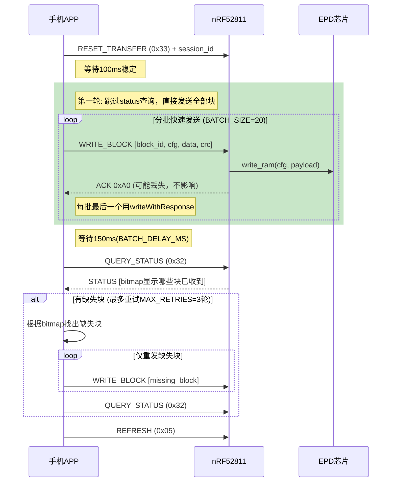
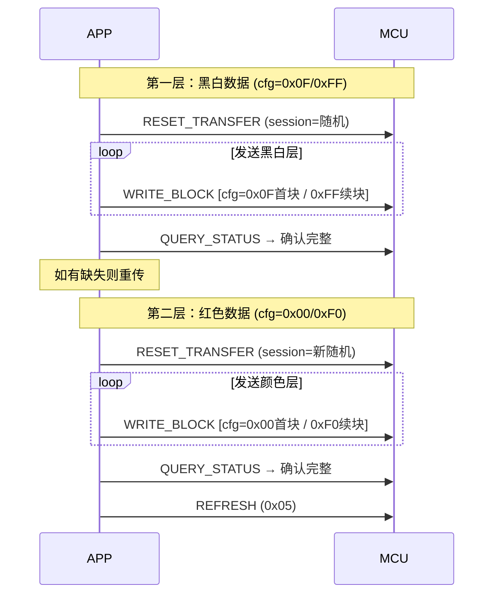

# BLE图像传输数据完整性保护方案（含断点续传）

> **版本**: v2.1 (2026-03-02)
> **状态**: 已实现并测试

## 问题分析

旧版流式传输 (`EPD_CMD_WRITE_IMAGE 0x30`) 存在的问题：
- **无校验机制**：数据包直接写入EPD RAM，无法检测丢包或损坏
- **不可恢复**：一旦数据丢失，无法重传，导致显示错乱
- **断连后丢失**：重连后需要从头开始传输

---

## 方案设计：分块CRC校验 + 分批确认 + 断点续传

### 新增命令

| 命令 | ID | 方向 | 说明 |
|------|----|------|------|
| `EPD_CMD_WRITE_BLOCK` | 0x31 | APP→MCU | 带CRC16校验的分块写入（含图层信息） |
| `EPD_CMD_QUERY_STATUS` | 0x32 | APP→MCU | 查询传输状态（用于断点续传） |
| `EPD_CMD_RESET_TRANSFER` | 0x33 | APP→MCU | 重置传输状态 |

### 响应格式（MCU→APP通知）

| 响应 | 格式 | 说明 |
|------|------|------|
| ACK | `[0xA0, block_id_L, block_id_H, 0x00]` | 块接收成功 |
| NACK(CRC) | `[0xA0, block_id_L, block_id_H, 0x01]` | CRC错误，请求重传 |
| NACK(参数) | `[0xA0, block_id_L, block_id_H, 0x02]` | 参数无效(block_id/total越界) |
| STATUS | `[0xA1, total_L, total_H, received_L, received_H, session, active, bitmap...]` | 传输状态(bitmap只发送有效长度) |

---

## 协议格式

### WRITE_BLOCK (0x31) 数据包格式

```
┌─────────┬──────────┬───────────┬─────────┬────────────┬──────────┐
│ CMD     │ Block ID │ Total Blk │ CFG     │ Payload    │ CRC16    │
│ (1byte) │ (2bytes) │ (2bytes)  │ (1byte) │ (N bytes)  │ (2bytes) │
└─────────┴──────────┴───────────┴─────────┴────────────┴──────────┘
   0x31      小端序     小端序      图层+首块   图像数据     校验值
```

- **最小包长度**: 8字节 (无payload时)
- **CRC校验范围**: 仅payload部分
- **CRC算法**: CRC16-CCITT (初值0xFFFF, 多项式0x8408, LSB优先)

### CFG字节说明

| 位 | 说明 | 值 |
|----|------|-----|
| bit[3:0] | 图层 | `0x0F` = 黑白层, `0x00` = 颜色/红色层 |
| bit[7:4] | 首块标志 | `0x00` = 首块(发送RAM命令), `0xF0` = 续块(仅发数据) |

示例：
- 黑白层首块: `cfg = 0x0F` → 发送write_ram命令+数据
- 黑白层续块: `cfg = 0xFF` → 仅发送数据
- 颜色层首块: `cfg = 0x00` → 发送write_ram命令+数据
- 颜色层续块: `cfg = 0xF0` → 仅发送数据

> **注意**: 首块标志由block_id==0决定，与断点续传中的重传块无关。
> APP端通过`block0Sent`标志跟踪是否已发送过block 0。

### QUERY_STATUS (0x32) 查询传输状态

```
请求: [0x32]
响应: [0xA1, total_L, total_H, received_L, received_H, session_id, active, bitmap[0..N]]
```

> bitmap只发送 `ceil(total_blocks/8)` 字节，不发送无用尾部。

### RESET_TRANSFER (0x33) 重置传输状态

```
请求: [0x33, session_id]
```

清零整个 `image_transfer_ctx_t` 结构体，设置新的session_id。

---

## 工作流程

### 分批确认传输流程

> **关键改进**：不再逐块等待ACK，而是快速发送一批后统一验证，解决了BLE通知丢失导致的超时问题。



### 三色屏双层传输流程



---

## MCU端实现 (EPD_service.c / EPD_service.h)

### 数据结构定义 (EPD_service.h)

```c
// 新增命令 (enum EPD_CMDS)
EPD_CMD_WRITE_BLOCK    = 0x31,  // 带CRC的分块写入
EPD_CMD_QUERY_STATUS   = 0x32,  // 查询传输状态
EPD_CMD_RESET_TRANSFER = 0x33,  // 重置传输状态

// 响应类型
#define EPD_RSP_BLOCK_ACK       0xA0  // 块ACK/NACK
#define EPD_RSP_STATUS          0xA1  // 状态响应

// 传输配置
#define EPD_MAX_BLOCKS          512   // 最大块数 (96KB / 192B)
#define EPD_BLOCK_BITMAP_SIZE   64    // 位图大小 (512/8 = 64字节)
#define EPD_MAX_RETRIES         3     // 最大重传次数

// 图像传输上下文（嵌入ble_epd_t结构体中）
typedef struct {
    uint8_t  session_id;                           // 会话ID
    uint16_t total_blocks;                         // 总块数
    uint16_t received_blocks;                      // 已接收块数
    uint8_t  block_bitmap[EPD_BLOCK_BITMAP_SIZE];  // 位图记录已收到的块
    bool     transfer_active;                      // 是否有活跃传输
} image_transfer_ctx_t;

// ble_epd_t 中新增字段:
image_transfer_ctx_t transfer_ctx;
```

### CRC16计算 (EPD_service.c:113)

```c
// CRC16-CCITT (初值0xFFFF, 多项式0x8408反转, LSB优先)
static uint16_t crc16_compute(const uint8_t* data, uint16_t len) {
    uint16_t crc = 0xFFFF;
    for (uint16_t i = 0; i < len; i++) {
        crc ^= data[i];
        for (uint8_t j = 0; j < 8; j++) {
            crc = (crc & 1) ? (crc >> 1) ^ 0x8408 : crc >> 1;
        }
    }
    return crc;
}
```

### WRITE_BLOCK命令处理 (EPD_service.c:1115)

MCU收到 `0x31` 后的处理逻辑：

1. **长度检查**: `length < 8` 则丢弃
2. **EPD检查**: `p_epd->epd == NULL` 则丢弃
3. **解析数据包**: block_id(2) + total_blocks(2) + cfg(1) + payload(N) + crc16(2)
4. **CRC校验**: 仅对payload部分计算CRC16，与包尾的recv_crc对比
5. **CRC通过后的验证**:
   - block_id越界检查 (`>= EPD_MAX_BLOCKS || >= total_blocks`) → NACK 0x02
   - total_blocks合法性 (`== 0 || > EPD_MAX_BLOCKS`) → NACK 0x02
6. **传输上下文初始化** (首块或新传输):
   - 如果当前处于时钟模式，自动切换到图片模式
   - 重置bitmap和计数器
   - 检测total_blocks中途变化 → 自动重置
7. **重复块检测**: 通过bitmap判断，重复块不写入但仍ACK
8. **写入EPD RAM**: `p_epd->epd->drv->write_ram(p_epd->epd, cfg, payload, payload_len)`
9. **更新bitmap和计数器**
10. **发送ACK** (0x00) 或 **NACK** (0x01=CRC错误, 0x02=参数无效)
11. **喂看门狗**: `app_feed_wdt()`

### 状态查询响应 (EPD_service.c:152)

```c
static void send_transfer_status(ble_epd_t* p_epd) {
    uint8_t rsp[7 + EPD_BLOCK_BITMAP_SIZE];
    rsp[0] = EPD_RSP_STATUS;            // 0xA1
    rsp[1..2] = total_blocks (小端序);
    rsp[3..4] = received_blocks (小端序);
    rsp[5] = session_id;
    rsp[6] = transfer_active ? 1 : 0;

    // 优化: 只发送必要的位图长度 ceil(total_blocks/8)
    uint16_t bitmap_len = (total_blocks + 7) / 8;
    memcpy(&rsp[7], block_bitmap, bitmap_len);

    ble_epd_string_send(p_epd, rsp, 7 + bitmap_len);
}
```

### 紧急命令配置 (EPD_service.c:345)

```c
// CRC传输命令绕过命令队列，直接执行
static bool is_urgent_command(uint8_t cmd) {
    return (cmd == EPD_CMD_SYS_RESET ||
            cmd == EPD_CMD_SYS_SLEEP ||
            cmd == EPD_CMD_CFG_ERASE ||
            cmd == EPD_CMD_WRITE_BLOCK ||     // 必须立即执行
            cmd == EPD_CMD_QUERY_STATUS ||     // 必须立即执行
            cmd == EPD_CMD_RESET_TRANSFER);    // 必须立即执行
}
```

> **为什么要设为紧急命令？**
> 命令队列一次只执行一个命令，如果WRITE_BLOCK进入队列排队，ACK响应会严重延迟，
> 导致APP端超时。将传输命令设为紧急命令后直接在BLE回调中执行。

---

## APP端实现

### 模块架构

| 文件 | 角色 | 说明 |
|------|------|------|
| `html/js/ble_transfer.js` | 核心传输模块 | CRC计算、分批发送、状态查询、重传逻辑 |
| `html/js/main.js` | 集成层 | writeImageCRC()包装、handleNotify路由、版本检测 |

### BleTransfer 对象 (ble_transfer.js)

```javascript
const BleTransfer = {
    // ===== 配置常量 =====
    MAX_RETRIES: 3,          // 最大重试轮数
    BATCH_SIZE: 20,          // 每批发送块数(在batch最后一块用writeWithResponse)
    BATCH_DELAY_MS: 150,     // 批次后等待MCU处理的延迟
    logLevel: 2,             // 0=关闭, 1=错误, 2=信息, 3=调试

    // ===== 状态变量 =====
    sessionId: 0,            // 当前会话ID (Date.now() & 0xFF)
    currentLayer: 0x0F,      // 当前图层: 0x0F=黑白, 0x00=颜色
    block0Sent: false,       // 跟踪block 0是否已发送(决定cfg首块标志)

    // ===== 核心方法 =====

    crc16(data),                    // CRC16-CCITT计算 (与MCU端一致)
    isConnected(),                  // 检查BLE连接状态
    handleNotification(value),      // 处理MCU通知(0xA0=ACK, 0xA1=STATUS)
    queryStatus(timeout=2000),      // 发送0x32查询，等待0xA1通知响应
    resetTransfer(newSessionId),    // 发送0x33重置，初始化统计
    sendBlockFast(blockId, totalBlocks, payload, withResponse), // 发送单块
    getMissingBlocks(status, totalBlocks),  // 从bitmap解析缺失块列表
    sendImageWithResume(data, step, onProgress), // 主传输入口

    // ===== 传输速度统计 =====
    transferStats: { startTime, bytesSent, blocksSent },
    getTransferSpeed(),             // → { bytesPerSecond, kbps, elapsed }
    getSpeedString(),               // → "12.5 KB/s"
};
```

### 传输流程详解 (sendImageWithResume)

```
1. 检查BLE连接
2. 计算chunkSize = max(MTU - 8, 20)  // 8字节协议开销
3. totalBlocks = ceil(data.length / chunkSize)
4. 设置currentLayer
5. resetTransfer() → 发送0x33, 重置统计

6. for (retryRound = 0..2):   // MAX_RETRIES=3
    a. 第一轮: 跳过queryStatus, 直接发送全部块
       后续轮: queryStatus获取bitmap, 计算缺失块
    b. 如果缺失块=0, 返回成功
    c. 分批发送缺失块:
       - 每BATCH_SIZE个块或最后一块用writeWithResponse
       - 每10块检查一次BLE连接
       - 每块回调onProgress更新进度和速度
    d. 等待BATCH_DELAY_MS
    e. 第一轮额外: queryStatus检查是否全部完成

7. 全部重试失败 → throw Error
```

### main.js集成

```javascript
// 版本检测: 仅固件 >= 0x20 且 BleTransfer模块存在时启用CRC传输
const useCRC = (appVersion >= 0x20) && (typeof BleTransfer !== 'undefined');
const transferFn = useCRC ? writeImageCRC : writeImage;

// writeImageCRC: 调用BleTransfer.sendImageWithResume
// 失败时自动回退到旧版writeImage (无CRC)

// handleNotify: 0xA0/0xA1响应路由到BleTransfer.handleNotification
// connect: 成功后调用BleTransfer.init()
```

---

## 文件修改清单

| 操作 | 文件 | 关键改动 |
|------|------|----------|
| MODIFY | `EPD/EPD_service.h` | 新增命令枚举、响应宏、传输常量、`image_transfer_ctx_t`结构体、`ble_epd_t`新增`transfer_ctx`字段 |
| MODIFY | `EPD/EPD_service.c` | `crc16_compute()`, `send_block_response()`, `send_transfer_status()`, `WRITE_BLOCK/QUERY_STATUS/RESET_TRANSFER` case处理, `is_urgent_command()`扩展 |
| NEW | `html/js/ble_transfer.js` | BleTransfer对象完整实现(CRC、分批确认、断线检测、速度统计、日志) |
| MODIFY | `html/js/main.js` | `writeImageCRC()`包装、`handleNotify()`路由、`connect()`中初始化、`EpdCmd`新增命令常量 |
| MODIFY | `html/index.html` | 添加 `ble_transfer.js` 脚本引用 |

---

## 已修复的问题

| 问题 | 原因 | 解决方案 |
|------|------|----------|
| ACK频繁超时 | 新命令进入队列被延迟执行 | 将WRITE_BLOCK等设为紧急命令(is_urgent_command) |
| 三色屏红色丢失 | cfg参数写死为黑白层 | 协议新增cfg字节，APP传入图层信息 |
| BLE通知丢失 | 逐块等待ACK，通知丢失即超时 | 改用分批确认模式(queryStatus+bitmap) |
| 时钟模式下写入冲突 | 时钟模式定时刷新与图像写入冲突 | MCU端收到首块时自动切换到图片模式 |
| total_blocks中途变化 | APP端bug或新传输 | MCU检测到变化后自动重置传输上下文 |

---

## 资源评估

| 资源 | 占用 | 说明 |
|------|------|------|
| MCU RAM | +72字节 | `image_transfer_ctx_t` (1+2+2+64+1+padding) |
| MCU Flash | ~700字节 | CRC函数+命令处理+状态响应 |
| 传输协议开销 | +8字节/块 | cmd(1)+block_id(2)+total(2)+cfg(1)+crc(2) |
| 实际开销比例 | ~4.2% | 以MTU=200, payload=192B为例: 8/200 |

## 向后兼容

- 保留 `EPD_CMD_WRITE_IMAGE (0x30)` 旧版传输逻辑，不受影响
- APP通过固件版本号判断: `appVersion >= 0x20` 时启用CRC传输
- CRC传输失败时自动回退到旧版传输 (writeImageCRC catch → writeImage)
- 旧APP（不使用0x31/0x32/0x33）继续正常工作

## CRC算法一致性

MCU端(C)和APP端(JS)使用相同的CRC16-CCITT算法：
- 初始值: `0xFFFF`
- 多项式: `0x8408` (标准CCITT 0x1021的bit反转)
- 处理方式: LSB优先 (右移)
- 校验范围: 仅payload数据部分
